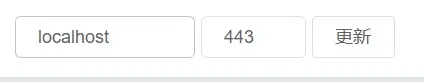

Language
> ***简体中文***  
> [English](english/443.md)  

[<=点此返回README](README.md)

***
# 为同一主机的443端口配置HTTPS反向代理

> 本文基于 [配置HTTPS反向代理且合并端口](配置HTTPS反向代理且合并端口.md) 进行修改。  
> ⚠如果您正在使用中国内地的主机，必须先对您的根域名进行ICP备案。  
> 本文**不是**MCSManager官方开发人员写的。  

<br />

## 合并端口的原理

MCSManager访问Daemon端的路径开头（与Web面板路径开头不冲突）：  
> /socket.io/  
> /upload/  
> /download/  

Nginx里的location匹配优先级从高到低是：  
```nginx
location =/test.txt {}              # 匹配完全相等的路径
location ~ (^/path/)|(^/path2/) {}  # 匹配正则表达式
location /path/ {}                  # 匹配单个路径开头
```

依据这些特性，将两者端口合并，以减少公网监听端口数量。   

<br />

## 生成SSL证书

可以在免费SSL的网站上，为自己的域名生成90天免费证书（可无限续签），用于建立安全的HTTPS连接。  
> <a href="https://www.cersign.com/free-ssl-certificate.html" target="_blank">https://www.cersign.com/free-ssl-certificate.html</a>  
> <a href="https://www.mianfeissl.com/" target="_blank">https://www.mianfeissl.com/</a>  
> <a href="https://zerossl.com/" target="_blank">https://zerossl.com/</a>  

### ⚠别泄露私钥！私钥泄露会导致HTTPS形同虚设！

⚠如果您正在使用中国内地的主机，必须先对您的根域名进行ICP备案。  

<br />

## 配置反向代理

如果你直接使用原生nginx配置，请编译安装最新版nginx，然后替换 `nginx.conf` 里的 `http{}` 。  
如果你使用面板搭建网站（例如宝塔、1panel），请自行截取相关 `server{}` 块修改（除了阻止跨域访问的）。  

> <a href="https://proxyformcsm.bddjr.com/generator.html?https=1&mergeports=1&webproxyport=443&domain=mcsm.domain.com" target="_blank">配置文件的主要参数改起来有些麻烦？试试这款生成器吧！</a>  

假设：
> 使用 ***mcsm.example.com*** 连接面板与守护节点  

```nginx
http {
    # 配置SSL证书。以下监听的ssl端口将默认使用该证书。
    #SSL-START
    ssl_certificate "/etc/nginx/ssl/example.com.crt";
    ssl_certificate_key "/etc/nginx/ssl/example.com_ECC.key";

    ssl_session_cache shared:SSL:1m;
    ssl_session_timeout  10m;
    ssl_protocols TLSv1.0 TLSv1.1 TLSv1.2 TLSv1.3; # 允许使用这些加密方式建立连接
    ssl_verify_client off; # 不验证客户端的证书
    #SSL-END

    # 传输时默认开启gzip压缩
    gzip on;
    # 传输时会被压缩的类型（应当依据文件压缩效果添加）
    gzip_types text/plain text/css application/javascript application/xml application/json;
    # 反向代理时，启用压缩
    gzip_proxied any;
    # 传输时压缩等级，等级越高压缩消耗CPU越多，最高9级，通常5级就够了
    gzip_comp_level 5;
    # 传输时大小达到1k才压缩，压缩小内容无意义
    gzip_min_length 1k;

    # 响应头中的server仅返回nginx，不返回版本号。
    server_tokens  off;

    # 不限制客户端上传文件大小
    client_max_body_size 0;

    server {
        # 这块是用于阻止跨域访问的。

        # 代理后HTTPS端口
        listen 443 ssl ;
        listen [::]:443 ssl ; #IPv6

        # 代理后HTTP端口
        listen 80 default ;
        listen [::]:80 default ; #IPv6

        # 若使用的域名在其它server{}中都无法匹配，则会匹配这里。
        server_name _ ;

        # 使用https访问时，直接断开连接，不返回证书。
        # 如果你需要套DNS的CDN高防，则不应该删除此块，那样更容易导致证书泄露，攻击者扫到IP后直接将源IP与域名绑定在一起。
        ssl_reject_handshake on;

        # 使用HTTP访问时，断开连接。
        error_page 497 =200 /;
        location / {
            return 444;
        }
    }
    server {
        # Daemon 端代理后localhost访问HTTP协议端口
        listen 127.0.0.1:443 ;
        listen [::1]:443 ; #IPv6

        # 本地回环域名
        server_name localhost ;

        # 本地回环地址不占宽带，无需压缩。
        gzip off;

        # 开始反向代理
        # 代理Daemon端
        location / {
            # 填写Daemon端真正监听的端口号
            proxy_pass http://localhost:24444 ;

            # 一些请求头
            proxy_set_header Host $host;
            proxy_set_header X-Real-IP $remote_addr;
            proxy_set_header X-Forwarded-For $proxy_add_x_forwarded_for;
            proxy_set_header REMOTE-HOST $remote_addr;
            # 用于WebSocket的必要请求头
            proxy_set_header Upgrade $http_upgrade;
            proxy_set_header Connection "upgrade";
            # 增加响应头
            add_header X-Cache $upstream_cache_status;
        }
    }
    server {
        # 代理后公网HTTPS端口
        listen 443 ssl ;
        listen [::]:443 ssl ; #IPv6

        # 代理后HTTP端口
        listen 80 ;
        listen [::]:80 ; #IPv6

        # 你访问时使用的域名
        server_name mcsm.example.com ;

        # HTTP跳转到HTTPS
        error_page 497 https://$host$request_uri; 
        if ($scheme = "http"){
            return 302 https://$host$request_uri;
        }

        # 开始反向代理
        # 代理Daemon端
        location ~ (^/socket.io/)|(^/upload/)|(^/download/) {
            # 填写Daemon端真正监听的端口号，后面不能加斜杠！
            proxy_pass http://localhost:24444 ;

            # 一些请求头
            proxy_set_header Host $host;
            proxy_set_header X-Real-IP $remote_addr;
            proxy_set_header X-Forwarded-For $proxy_add_x_forwarded_for;
            proxy_set_header REMOTE-HOST $remote_addr;
            # 用于WebSocket的必要请求头
            proxy_set_header Upgrade $http_upgrade;
            proxy_set_header Connection "upgrade";
            # 增加响应头
            add_header X-Cache $upstream_cache_status;
        }
        # 代理Web端
        location / {
            # 填写Web面板端真正监听的端口号
            proxy_pass http://localhost:23333 ;

            # 一些请求头
            proxy_set_header Host $host;
            proxy_set_header X-Real-IP $remote_addr;
            proxy_set_header X-Forwarded-For $proxy_add_x_forwarded_for;
            proxy_set_header REMOTE-HOST $remote_addr;
            # 用于WebSocket的必要请求头
            proxy_set_header Upgrade $http_upgrade;
            proxy_set_header Connection "upgrade";
            # 增加响应头
            add_header X-Cache $upstream_cache_status;
            # 仅允许客户端使用HTTPS发送Cookie
            proxy_cookie_flags ~ secure;
            # 客户端访问后1年内HTTP自动跳转HTTPS（清浏览器缓存后失效）
            add_header Strict-Transport-Security "max-age=31536000";
        }
    }
}
```

**配置完成后，重启 Nginx 服务（以下命令用于Linux操作系统）**  
如果你使用面板搭建网站，请在面板里重载，而不是使用这条命令。  
```bash
systemctl restart nginx
```

<br />

## 客户端访问面板

```
https://mcsm.example.com/
```

**⚠请确保反向代理后的端口都通过了服务器的防火墙，否则您是无法正常访问的。**  
⚠如果您正在使用中国内地的主机，必须先对您的根域名进行ICP备案。  

<br />

## 连接Daemon端

### 本地回环地址  
> 在**节点管理**中，填写地址为 ***localhost*** ，端口填写443，然后单击右侧的 **连接** 或 **更新** 即可。  
> **⚠不能将地址填写为 *ws://localhost* ！这会导致浏览器尝试使用HTTP协议连接！**  
> 
> 

如果回环地址出现了冲突，请尝试将相关的 `localhost` 修改为 `127.0.0.0/24` 段的其它IPv4 ，例如 `127.0.0.244` 。（[参考mcsm9的前端相关源码](https://github.com/MCSManager/UI/blob/master/src/app/service/protocol.js#L131)，未验证有效性）
```nginx
        # Daemon 端代理后localhost访问HTTP协议端口
        listen 127.0.0.244:443 ;

        # 本地回环域名
        server_name 127.0.0.244 ;
```

<br />

***
## 非常感谢您能阅读我写的教程，希望对你有帮助！
有错误的内容或改进的建议？或者没弄懂怎么配置？[点此编辑并提交issue](../../issues/new)。  

### 想要分享该文档？  
[Gitee 仓库（中国内地访问稳定）：](https://gitee.com/bddjr/nginx-proxy-docs-for-mcsm/blob/master/%E4%B8%BA%E5%90%8C%E4%B8%80%E4%B8%BB%E6%9C%BA%E7%9A%84443%E7%AB%AF%E5%8F%A3%E9%85%8D%E7%BD%AEHTTPS%E5%8F%8D%E5%90%91%E4%BB%A3%E7%90%86.md)  
```
https://gitee.com/bddjr/nginx-proxy-docs-for-mcsm/blob/master/%E4%B8%BA%E5%90%8C%E4%B8%80%E4%B8%BB%E6%9C%BA%E7%9A%84443%E7%AB%AF%E5%8F%A3%E9%85%8D%E7%BD%AEHTTPS%E5%8F%8D%E5%90%91%E4%BB%A3%E7%90%86.md
```
[Github 仓库：](https://github.com/bddjr/nginx-proxy-docs-for-mcsm/blob/master/%E4%B8%BA%E5%90%8C%E4%B8%80%E4%B8%BB%E6%9C%BA%E7%9A%84443%E7%AB%AF%E5%8F%A3%E9%85%8D%E7%BD%AEHTTPS%E5%8F%8D%E5%90%91%E4%BB%A3%E7%90%86.md)  
```
https://github.com/bddjr/nginx-proxy-docs-for-mcsm/blob/master/%E4%B8%BA%E5%90%8C%E4%B8%80%E4%B8%BB%E6%9C%BA%E7%9A%84443%E7%AB%AF%E5%8F%A3%E9%85%8D%E7%BD%AEHTTPS%E5%8F%8D%E5%90%91%E4%BB%A3%E7%90%86.md
```
[Github Page + Cloudflare CDN 网页：](https://proxyformcsm.bddjr.com/%E4%B8%BA%E5%90%8C%E4%B8%80%E4%B8%BB%E6%9C%BA%E7%9A%84443%E7%AB%AF%E5%8F%A3%E9%85%8D%E7%BD%AEHTTPS%E5%8F%8D%E5%90%91%E4%BB%A3%E7%90%86.html)  
```
https://proxyformcsm.bddjr.com/%E4%B8%BA%E5%90%8C%E4%B8%80%E4%B8%BB%E6%9C%BA%E7%9A%84443%E7%AB%AF%E5%8F%A3%E9%85%8D%E7%BD%AEHTTPS%E5%8F%8D%E5%90%91%E4%BB%A3%E7%90%86.html
```

***
[<=点此返回README](README.md)

> 源码仓库：<a href="https://github.com/bddjr/nginx-proxy-docs-for-mcsm" target="_blank">nginx-proxy-docs-for-mcsm</a><br/>
> Made by <a href="https://bddjr.cn" target="_blank" rel="noopener">bddjr</a>
