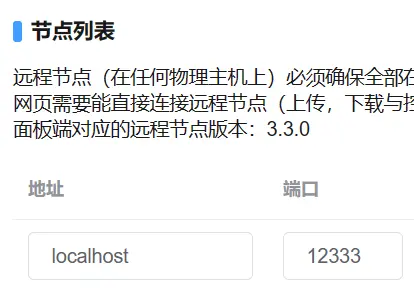

[<=点此返回README](README.md)

***
# 配置 HTTP 反向代理且合并Web面板与守护节点的端口

合并端口通常仅用于Web面板与守护进程在同一主机的情况。  

> 本文基于 [配置HTTP反向代理](配置HTTP反向代理.md) 进行修改。  
> 若您需要 HTTPS 反向代理且合并端口，请参考 [配置HTTPS反向代理且合并端口](配置HTTPS反向代理且合并端口.md) 。  

注释：  
> 本地回环地址：例如域名 **localhost** IPv4 **127.0.0.1** 。  
> 守护进程：意思同守护节点、Daemon节点、Daemon进程、Daemon端。  

### 警告⚠：
> 使用HTTP协议可能导致毫不知情的遭到网页内容**篡改**、**窃取**连接内容，若想要确保连接安全，请 [配置HTTPS反向代理且合并端口](配置HTTPS反向代理且合并端口.md) 。  
> 本文**不是**MCSManager官方开发人员写的，但大部分内容已实测有效，仅供参考。  

<br />

## 合并端口的原理

MCSManager访问守护进程时特有的路径开头（Web面板不会以这些作为路径开头）：
> /socket.io/  
> /upload/  
> /download/  

在Nginx中，匹配优先级从高到低是：  
```nginx
location =/test.txt {}    # 匹配完全相等的路径  
location ~ ^/path/ {}    # 匹配正则表达式  
location /path/ {}    # 匹配单个路径开头  
```

依据这些特性，我们可以使用反向代理，将两者端口合并，减少公网监听端口的占用数量。   

<br />

## 需要安装的

> [Nginx](https://nginx.org/)  
> [MCSManager](https://mcsmanager.com/)  

<br />

## 配置反向代理

以下示范环境是 **CentOS** 操作系统使用yum安装的Nginx **1.20.1** ，配置文件目录 **/etc/nginx/nginx.conf** ，Web面板 **9.8.0** ，守护进程 **3.3.0** 。  

```nginx
# For more information on configuration, see:
#   * Official English Documentation: http://nginx.org/en/docs/
#   * Official Russian Documentation: http://nginx.org/ru/docs/

user nginx;
worker_processes auto;
error_log /var/log/nginx/error.log;
pid /run/nginx.pid;

# Load dynamic modules. See /usr/share/doc/nginx/README.dynamic.
include /usr/share/nginx/modules/*.conf;

events {
    worker_connections 1024;
}

# 以上内容可能已经包含在nginx.conf里，确保目录在您的操作系统中真实存在即可。
#========================================================
# 以下才是需要理解并修改的内容。
# 仅供参考，请依据自己的需求以及运行环境进行更改。
# 假设：
#    只需监听IPv4的端口
#    Daemon端真正监听的端口：24444
#    Web面板端真正监听的端口：23333
#    代理后端口：12333
#    需要允许主域名 domain.com 及其任意子域名访问

http {
    # 这块是在传输时默认开启gzip压缩
    gzip on;
    # 传输时需要被压缩的类型
    gzip_types text/plain text/css application/javascript application/xml application/json image/png;
    # 反向代理时，启用压缩
    gzip_proxied any;
    # 传输时压缩等级，等级越高压缩消耗CPU越多，最高9级
    gzip_comp_level 5;
    # 传输时大小达到1k才压缩
    gzip_min_length 1k;

    # 响应头中的server仅返回nginx，不返回版本号。
    server_tokens  off;

    # 不限制客户端上传文件大小
    client_max_body_size 0;

    server {
        # 这块是用于阻止跨域访问的。

        # 代理后端口
            listen 12333 default ;
        # 可以通过多个listen监听多个地址与端口。

        server_name _ ; #若使用的域名在其它server{}中都无法匹配，则会匹配这里。
        return 444; # 断开连接。
    }
    server {
        # Daemon 端代理后localhost访问HTTP协议端口
            listen 127.0.0.1:12333 ;
        # 可以通过多个listen监听多个地址与端口。

        server_name localhost ;

        gzip off; # 本地回环地址不占宽带，无需压缩。

        # 开始反向代理
        # 代理Daemon节点
        location / {
            # 填写Daemon进程真正监听的端口号
            proxy_pass http://localhost:24444 ;

            # 一些请求头
            proxy_set_header Host $host:$server_port;
            proxy_set_header X-Real-IP $remote_addr;
            proxy_set_header X-Forwarded-For $proxy_add_x_forwarded_for;
            proxy_set_header REMOTE-HOST $remote_addr;
            # 用于WebSocket的必要请求头
            proxy_set_header Upgrade $http_upgrade;
            proxy_set_header Connection "upgrade";
            # 增加响应头
            add_header X-Cache $upstream_cache_status;
            expires -1; # 禁止客户端缓存
        }
    }
    server {
        # 代理后的公网访问HTTP协议端口
            listen 12333 ;
        # 可以通过多个listen监听多个地址与端口。

        # 你访问时使用的域名（支持通配符，但通配符不能用于根域名）
        server_name domain.com *.domain.com ;

        # 这里不需要设置返回 robots.txt ，因为面板UI已经包含该文件。

        # 开始反向代理
        # 代理Daemon节点
        location ~ (^/socket.io/)|(^/upload/)|(^/download/) {
            # 填写Daemon进程真正监听的端口号，后面不能加斜杠！
            proxy_pass http://localhost:24444 ;

            # 一些请求头
            proxy_set_header Host $host:$server_port;
            proxy_set_header X-Real-IP $remote_addr;
            proxy_set_header X-Forwarded-For $proxy_add_x_forwarded_for;
            proxy_set_header REMOTE-HOST $remote_addr;
            # 用于WebSocket的必要请求头
            proxy_set_header Upgrade $http_upgrade;
            proxy_set_header Connection "upgrade";
            # 增加响应头
            add_header X-Cache $upstream_cache_status;
            expires -1; # 禁止客户端缓存
        }
        # 代理Web端
        location / {
            # 填写Web面板端真正监听的端口号
            proxy_pass http://localhost:23333 ;

            # 一些请求头
            proxy_set_header Host $host:$server_port;
            proxy_set_header X-Real-IP $remote_addr;
            proxy_set_header X-Forwarded-For $proxy_add_x_forwarded_for;
            proxy_set_header REMOTE-HOST $remote_addr;
            # 用于WebSocket的必要请求头
            proxy_set_header Upgrade $http_upgrade;
            proxy_set_header Connection "upgrade";
            # 增加响应头
            add_header X-Cache $upstream_cache_status;
            expires -1; # 禁止客户端缓存
        }
    }

}
```

> 没有自己的域名？  
> 你可以去 <https://www.dnspod.cn> 或 <https://wanwang.aliyun.com> 购买域名  
> .top 后缀的域名首年仅9元，续费一年仅29元！  
> （这里作者没恰饭，单纯推荐一下） 

配置完成后，重启 Nginx 服务（以下命令用于Linux操作系统）
```bash
systemctl restart nginx
```

<br />

## 客户端访问面板

假如域名是 **domain.com** ，反向代理后的端口是12333，那么浏览器需要使用这个地址访问面板：
```
http://domain.com:12333/
```

**⚠请确保反向代理后的端口都通过了服务器的防火墙，否则您是无法正常访问的。**  

<br />

## 连接守护进程

假如Web面板后台通过 **localhost** 域名连接节点，那么在**节点管理**中填写地址为 **localhost** ，端口填写反向代理后的端口号（例如12333），然后单击右侧的 **连接** 或 **更新** 即可。  
也可以将地址填写为 **ws://localhost** 。  
假如需要填远程地址 **domain.com** ，那么将 **localhost** 改为 **domain.com** 即可。



<br />

## 恭喜你，基础配置完成了！

为了安全，您应当在防火墙中，禁止通过以下端口访问：
> Web面板端真正监听的端口（例如23333）  
> Daemon端真正监听的端口（例如24444） 

（本地回环地址不受防火墙限制）
<br />

***
## 非常感谢您能阅读我写的教程，希望对你有帮助！
有错误的内容或改进的建议？[点此编辑并提交issue](../../issues/new)。

想要分享该文档？  
github仓库短链接：  
```
https://q8p.cc/proxyformcsm/配置HTTP反向代理且合并端口.md
```
gitee镜像仓库短链接：  
```
https://q8p.cc/gtproxyformcsm/配置HTTP反向代理且合并端口.md
```
gitpage网页：  
```
https://proxyformcsm.bddjr.cn/配置HTTP反向代理且合并端口
```

***
[<=点此返回README](README.md)